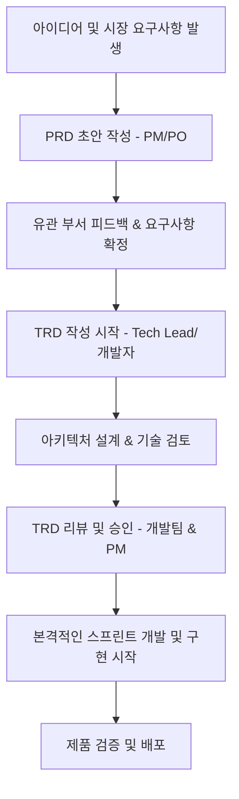

# PRD & TRD 기반 개발 프로세스 (PRD-TRD_example) 🚀

이 저장소는 **PRD (제품 요구사항 정의서)**와 **TRD (기술 요구사항 정의서)**를 활용하여 소프트웨어를 기획하고 개발하는 체계적인 프로세스를 보여줍니다.

> [!NOTE]  
> 모든 진행 상황과 산출물은 본 `README.md` 현황판에서 한눈에 모니터링할 수 있습니다.

---

## 📊 개발 프로세스 현황판 (Status Board)

이 프로젝트는 아래의 **4단계 프로세스**에 따라 개발을 진행하며, 사용자가 AI에게 명령을 내릴 수 있는 **단계별 프롬프팅 가이드**와 개발 결과를 기록하는 **보고서 양식**이 유기적으로 연동되어 있습니다.

| 단계 (Phase) | 상태 (Status) | 주요 작업 (Tasks) | 프롬프트 가이드 | 산출물 및 리포트 |
| :--- | :---: | :--- | :---: | :---: |
| **01. PRD 기획 확정** | 🟢 완료 | 요구사항 정의 및 MVP 기획 확정 | [01. PRD 프롬프트](file:///Users/ikarus1004/workspace/PRD-TRD_example/prompting/01.prd_generation.md) | [PRD 문서](file:///Users/ikarus1004/workspace/PRD-TRD_example/docs/prd/PRD_example.md) <br> [01. 기획 리포트](file:///Users/ikarus1004/workspace/PRD-TRD_example/report/01.prd_report.md) |
| **02. TRD 기술 설계** | 🟢 완료 | 아키텍처 설계, API 설계 및 예외 처리 | [02. TRD 프롬프트](file:///Users/ikarus1004/workspace/PRD-TRD_example/prompting/02.trd_generation.md) | [TRD 문서](file:///Users/ikarus1004/workspace/PRD-TRD_example/docs/trd/TRD_example.md) <br> [02. 설계 리포트](file:///Users/ikarus1004/workspace/PRD-TRD_example/report/02.trd_report.md) |
| **03. 기능 구현 및 개발** | 🟢 완료 | 실제 소스 코드 작성 및 기능 구현 | [03. 개발 프롬프트](file:///Users/ikarus1004/workspace/PRD-TRD_example/prompting/03.development.md) | [03. 개발 리포트](file:///Users/ikarus1004/workspace/PRD-TRD_example/report/03.dev_report.md) |
| **04. 테스트 및 검증** | 🟢 완료 | 테스트 시나리오 수행 및 품질 검증 | [04. 검증 프롬프트](file:///Users/ikarus1004/workspace/PRD-TRD_example/prompting/04.verification.md) | [04. 검증 리포트](file:///Users/ikarus1004/workspace/PRD-TRD_example/report/04.verify_report.md) |

- **상태 범례**: ⚪ 대기 (Todo) \| 🟡 진행중 (In Progress) \| 🟢 완료 (Done)

---

## 📌 목차 (Table of Contents)
1. [저장소 목적](#-저장소-목적)
2. [문서 구조](#-문서-구조)
   - [Product Requirement Document (PRD)](#1-product-requirement-document-prd)
   - [Technical Requirement Document (TRD)](#2-technical-requirement-document-trd)
3. [작성 프로세스 흐름도](#-작성-프로세스-흐름도)
4. [시작 가이드](#-시작-가이드)
5. [기여 안내](#-기여-안내)

---

## 🎯 저장소 목적
- **협업 시너지 극대화**: 기획자(PM/PO)와 개발자(Software Engineer/Architect) 간의 기술적 간극을 좁히고 명확한 요구사항 소통을 돕습니다.
- **표준 템플릿 제공**: 실무에서 즉시 활용할 수 있는 문서 포맷과 가이드라인을 제공합니다.
- **예시 기반 학습**: 가상의 서비스를 주제로 실제 작성된 PRD와 TRD 문서를 보며 작성 방법을 직관적으로 이해할 수 있습니다.

---

## 📂 문서 구조

프로젝트 루트 내에 다음과 같은 폴더 구조로 관리합니다.

```text
PRD-TRD_example/
├── README.md                 # 마스터 대시보드 및 프로세스 현황판
├── prompting/                # 사용자가 AI와 대화 시 복사할 단계별 프롬프트 가이드
│   ├── 01.prd_generation.md  # 1단계 기획용
│   ├── 02.trd_generation.md  # 2단계 기술설계용
│   ├── 03.development.md     # 3단계 소스코드개발용
│   └── 04.verification.md    # 4단계 QA검증용
├── report/                   # 각 단계 완료 시 산출되는 검토 및 결과 보고서
│   ├── 01.prd_report.md
│   ├── 02.trd_report.md
│   ├── 03.dev_report.md
│   └── 04.verify_report.md
├── docs/
│   ├── prd/                  # 제품 요구사항 정의서
│   │   └── PRD_example.md    # [Emotion Analyzer Web App PRD]
│   └── trd/                  # 기술 요구사항 정의서
│       └── TRD_example.md    # [Emotion Analyzer Web App TRD]
└── README.md
```

### 1. Product Requirement Document (PRD)
제품의 **"무엇을(What)"**, **"왜(Why)"** 만드는지에 집중하는 문서입니다.
- **주요 포함 내용**:
  - **제품 비전 & 배경**: 이 제품/기능을 왜 만들어야 하는가?
  - **목표 (Goals & Non-Goals)**: 성공 지표와 이번 범위에서 제외될 항목 정의.
  - **사용자 시나리오 (User Scenarios)**: 사용자 여정(User Journey) 정의.
  - **기능 요구사항 (Functional Requirements)**: 필요한 핵심 기능 목록 및 우선순위(P0, P1, P2).
  - **사용자 경험 & 디자인 링크**: UI/UX 와이어프레임 및 피그마 링크 등.

### 2. Technical Requirement Document (TRD)
PRD를 기반으로 제품을 **"어떻게(How)"** 구현할 것인지 기술적인 해결책을 정의하는 문서입니다.
- **주요 포함 내용**:
  - **시스템 아키텍처**: 전체적인 구성도, 데이터 흐름도.
  - **데이터 모델 설계**: 데이터베이스 스키마, ERD, 영속성 전략.
  - **API 명세**: 서비스 간 통신 규격, 주요 API Endpoint 디자인.
  - **인프라 및 보안**: 클라우드 인프라 아키텍처, 인증/인가 및 암호화 방식.
  - **성능 및 확장성**: 트래픽 대응 방안, 모니터링 및 로깅 전략.

---

## 🔄 작성 프로세스 흐름도



---

## 🚀 시작 가이드

이 저장소의 템플릿을 복사하여 자신만의 프로젝트에 적용할 수 있습니다.

1. **저장소 클론**:
   ```bash
   git clone https://github.com/i3estCorder/PRD-TRD_example.git
   ```
2. **템플릿 활용**:
   - `docs/prd/PRD_example.md`를 참고하여 새로운 기획 문서를 작성해 보세요.
   - `docs/trd/TRD_example.md`를 참고하여 기획에 맞는 시스템을 설계해 보세요.
   - 개발 및 QA 단계에서는 `prompting/` 폴더에 있는 프롬프트를 활용하여 AI 어시스턴트에게 가이드를 내리고, 각 단계 완료 후 `report/` 폴더에 결과 보고서를 업데이트하세요.

---

## 🤝 기여 안내
더 나은 템플릿이나 좋은 예시가 있다면 언제든 기여를 환영합니다!
1. 이 저장소를 Fork 합니다.
2. 새 브랜치를 생성합니다 (`git checkout -b feature/amazing-template`).
3. 수정사항을 Commit 합니다 (`git commit -m 'Add amazing template'`).
4. 브랜치에 Push 합니다 (`git push origin feature/amazing-template`).
5. Pull Request를 생성해 주세요.
